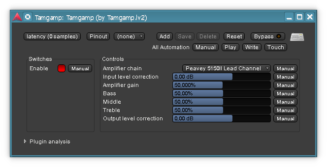

tamgamp.lv2 - Guitar amplifier simulator
========================================



Tamgamp (Rhymes with: "Damage Amp") is LV2 guitar amp simulator that provides two plugins:
* Tamgamp - a plugin based on Guitarix DK Builder simulated chains.
* TamgampGX - a plugin based on tuned Guitarix internal amplifiers implementation.

The key features of this project according to initial technical requirements are:
* Simplicity of the interface, no UI (use generic one), minimum knobs/sliders
* Preamplifier simulation only, no cabinet/power amplifier simulation is required.
* Smooth bypass button.
* Smooth switch between amplifier models.
* Smooth switch between tone control chains.
* Smooth knob control without pops and other sound artifacts which allows to apply automation to the plugin.
* Normalized output level: different amplifiers should sound almost of the same output loudness with different gain settings.

The reference to the original Guitarix project: https://guitarix.org/

It simulates the set of the following guitar amplifiers:

* Fender Princeton Reverb-amp AA1164 (without reverb module)
* Fender Twin Reverb-Amp AA769 (Normal channel, bright off)
* Fender Twin Reverb-Amp AA769 (Vibrato channel, bright on)
* Marshall JCM-800 High-gain input
* Marshall JCM-800 Low-gain input
* Mesa/Boogie DC3 preamplifier (lead channel)
* Mesa/Boogie DC3 preamplifier (rhythm channel)
* Mesa Dual Rectifier preamplifier (orange channel, less gain)
* Mesa Dual Rectifier preamplifier (red channel, more gain)
* Peavey 5150II crunch channel
* Peavey 5150II lead channel
* VOX AC-30 Brilliant channel
* VOX AC-30 normal channel

This project simulates only preamplifier chains and does not attempt to do any cab simulation,
so for proper sounding you need to additionally apply equalization or pre-captured impulse responses
of different cabinets.

For example, you may use the following tools for cabinet simulation:
* LSP Impulse Responses Mono - https://lsp-plug.in/?page=manuals&section=impulse_responses_mono
* LSP Impulse Reverb Mono - https://lsp-plug.in/?page=manuals&section=impulse_reverb_mono
* x42 Convolver - https://github.com/x42/convoLV2
* Guitarix convolver - https://guitarix.org/
* LV2 Convolution Reverb - http://tomszilagyi.github.io/plugins/ir.lv2/

Authors
------------

* The Tamgamp.lv2 project originated by Cyrus Adkisson.
* Tamgamp source code developed by Vladimir Sadovnikov <lsp.plugin@gmail.com>.
* DK Builder and Guitarix project are developed by Guitarix Team <http://guitarix.org/>:
  * Hermann Meyer
  * Andreas Degert
  * Pete Shorthose
  * Markus Schmidt

Requirements
------------

The following tools and libraries are required to build the project:
  * gcc >= 6.0
  * zita-resampler
  
The following additional tools and libraries are required to develop the project:
  * faust >= 2.15.11
  * faust-libraries 

Usage
-----

Select the preamplifier simulation using 'Amplifier chain' selector.

Set the 'Amplifier Gain' control to adjust pre-amplification gain. The more
pre-gain will be set, the more overdrive/distortion of the original signal will be
at the output.

To correct input/output levels, use 'Input level correction' and
'Output level correction' respectively.

Adjust the tone by 'Bass', 'Middle', 'Treble' controls (for TamgampGX you need to
select 'Tone Control Chain' first).

Enjoy!

Install
-------

The simple installation script looks like:

```bash
make
make install
```

Uninstalling and cleaning:

```bash
make uninstall
make clean
```


For developers: to re-generate all automatically generated code, launch:

```bash
make srcgen
```

To update file dependencies, launch:

```bash
make deps
```

